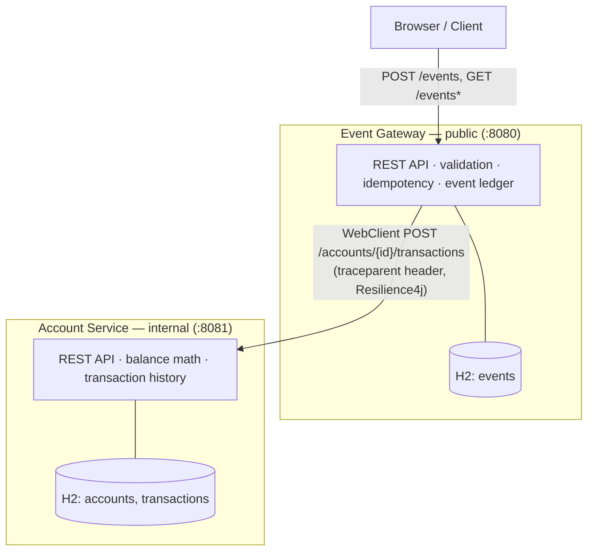

# Event Ledger

A small distributed system that ingests financial transaction events through a public
**Event Gateway** and applies them to account balances via an internal **Account Service**.
It is built to handle the two realities of unsynchronized upstreams — **duplicate** and
**out-of-order** delivery — and to **degrade gracefully** when a dependency is unavailable.

**Built with:** Java 21 · Spring Boot 3.4 (Spring MVC) · Maven multi-module · H2 (embedded, one per
service) · Resilience4j (circuit breaker, timeout, retry) · Micrometer Tracing + OpenTelemetry ·
Docker Compose. Each choice maps to a requirement below — the sections that follow explain how.

---

## Architecture



**Two independent services, no shared state:**

- **Event Gateway** (public-facing, port `8080`) — the entry point. Validates input, enforces
  idempotency, stores every event in its own ledger, and orchestrates the downstream apply by
  calling the Account Service over REST. All read endpoints are served from its **local** data.
- **Account Service** (internal, port `8081`) — owns account state: balances and transaction
  history, and all the money math. Only ever called by the Gateway.

Each service has its **own embedded H2 database** and its own process — they share no database
and no in-memory state. The only channel between them is a synchronous REST call. This separation
is what makes graceful degradation meaningful: the Gateway's reads keep working when the Account
Service is down, because that data lives locally.

> **Monorepo, but not shared code.** The two services live in one repository as two independent
> Maven modules (each with its own `pom.xml`, dependencies, database, and Dockerfile). They share
> no code — communication is via the REST contract, not shared types. The root `pom.xml` only
> aggregates the modules for a one-command build.

---

## API Reference

### Event Gateway (public)

| Method | Endpoint | Description |
|---|---|---|
| `POST` | `/events` | Submit a transaction event |
| `GET` | `/events/{id}` | Retrieve a single event by id |
| `GET` | `/events?account={accountId}` | List an account's events, ordered by `eventTimestamp` |
| `GET` | `/health` | Health check (with DB connectivity) |

### Account Service (internal)

| Method | Endpoint | Description |
|---|---|---|
| `POST` | `/accounts/{accountId}/transactions` | Apply a transaction (idempotent on `eventId`) |
| `GET` | `/accounts/{accountId}/balance` | Current balance |
| `GET` | `/accounts/{accountId}` | Account details + recent transactions |
| `GET` | `/health` | Health check (with DB connectivity) |

**Event payload** (`POST /events`):

```json
{
  "eventId": "evt-001",
  "accountId": "acct-123",
  "type": "CREDIT",
  "amount": 150.00,
  "currency": "USD",
  "eventTimestamp": "2026-05-15T14:02:11Z",
  "metadata": { "source": "mainframe-batch", "batchId": "B-9042" }
}
```

| Field | Required | Notes |
|---|---|---|
| `eventId` | yes | Unique id; the idempotency key |
| `accountId` | yes | Account the event belongs to |
| `type` | yes | `CREDIT` or `DEBIT` |
| `amount` | yes | Must be `> 0` |
| `currency` | yes | e.g. `USD` |
| `eventTimestamp` | yes | ISO-8601; when the event originally occurred |
| `metadata` | no | Opaque JSON; stored, not interpreted, not forwarded |

**Status codes:** `201` created & applied · `200` duplicate (returns the original) · `400`
validation error · `404` unknown id · `409` currency mismatch · `503` Account Service unavailable.

---

## Prerequisites

- **Docker + Docker Compose** (recommended path), **or**
- **JDK 21** and **Maven 3.9+** (manual path)

No other setup — dependencies resolve via Maven, and each service uses an in-memory H2 database
(nothing to provision).

---

## Running the system

### Option A — Docker Compose (recommended)

Runs both services wired together — no host JDK/Maven needed. The Gateway reaches the Account
Service by its Compose service name (`http://account-service:8081`) and waits for it to be healthy
before starting.

```bash
# Build from source and start (use this the first time, and after any code change)
docker compose up --build

# Start without rebuilding (subsequent runs)
docker compose up

# Run detached (in the background) — add -d to either command above
docker compose up --build -d

# Stop and remove the containers + network
docker compose down
```

- Gateway → http://localhost:8080
- Account Service → http://localhost:8081

> Foreground runs stream both services' logs (`Ctrl-C` to stop). The databases are in-memory H2, so
> `docker compose down` (or any restart) starts fresh with no data.

### Option B — Manual (two terminals)

Build once, then run each service (start the Account Service first):

```bash
mvn -q -T1C package -DskipTests

# terminal 1
java -jar account-service/target/account-service-1.0.0.jar

# terminal 2
java -jar event-gateway/target/event-gateway-1.0.0.jar
```

In the manual setup the Gateway defaults to `http://localhost:8081` for the Account Service, so no
configuration is needed. (Override with the `ACCOUNT_SERVICE_BASE_URL` environment variable.)

---

## Trying it out

```bash
# 1. Submit an event  → 201, status APPLIED
curl -s -X POST http://localhost:8080/events -H 'Content-Type: application/json' -d '{
  "eventId":"evt-001","accountId":"acct-123","type":"CREDIT","amount":150.00,
  "currency":"USD","eventTimestamp":"2026-05-15T14:02:11Z"}'

# 2. Idempotency: resubmit the same eventId → 200, original returned, balance unchanged
curl -s -X POST http://localhost:8080/events -H 'Content-Type: application/json' -d '{
  "eventId":"evt-001","accountId":"acct-123","type":"CREDIT","amount":999.00,
  "currency":"USD","eventTimestamp":"2026-05-15T14:02:11Z"}'

# 3. A DEBIT, then check the balance (150 - 50 = 100)
curl -s -X POST http://localhost:8080/events -H 'Content-Type: application/json' -d '{
  "eventId":"evt-002","accountId":"acct-123","type":"DEBIT","amount":50.00,
  "currency":"USD","eventTimestamp":"2026-05-15T15:00:00Z"}'
curl -s http://localhost:8081/accounts/acct-123/balance

# 4. Out-of-order: events are listed by eventTimestamp, not arrival order
curl -s "http://localhost:8080/events?account=acct-123"

# 5. Graceful degradation: stop the Account Service, then submit — you get a clean 503
#    (with the stored event, marked FAILED), while GET /events/* still works.
```

---

## Running the tests

```bash
mvn test      # 27 fast component tests (both services) — no Docker required
mvn verify    # the above + 1 real cross-process end-to-end test (needs Docker)
```

Everything is runnable from the repo root with standard Maven commands. The suite splits into
fast, hermetic component tests (`mvn test`) and one real integration test (`mvn verify`), following
the standard Surefire/Failsafe convention.

**What's covered:**

- **Core functionality** — idempotency (duplicate → original, no balance change), out-of-order
  tolerance (listing order + commutative balance), balance math, `BigDecimal` precision, and a
  validation sweep (missing fields, zero/negative amount, unknown type, malformed body → `400`).
- **Resiliency** — Account Service failure → `503` with the event retained as `FAILED` and local
  reads still working; slow response → timeout → `503`; repeated failures **open the circuit
  breaker** and later calls fast-fail without reaching the dependency; retries are **bounded**.
- **Trace propagation** — the real end-to-end test (`FullFlowIT`) runs **both services as
  containers** and asserts the Gateway's trace id appears in the Account Service's logs.
- **Integration** — that same test exercises the full Gateway → Account Service flow and checks the
  balance actually updates across the wire.

---

## Resiliency

The Gateway wraps its one outbound call (to the Account Service) with **Resilience4j**, composed as
**retry ( circuit breaker ( timeout ( call ) ) )**:

| Pattern | Guards against | Behavior |
|---|---|---|
| **Circuit breaker** *(primary)* | a dependency that is **down** | after ≥50% of a 10-call window fails, it opens for 5s and **fast-fails** — no wasted calls on a dead dependency, then auto-probes to recover |
| **Timeout** (2s per attempt) | a **slow / hanging** dependency | abandons the attempt so the Gateway never hangs (and never returns a `500`) |
| **Retry** (3× exp. backoff + jitter) | **transient** blips | retries a bounded number of times, then gives up — never retries indefinitely |

**Why circuit breaker as the primary choice:** it directly satisfies the requirement to "stop
calling a repeatedly-failing dependency and return a meaningful error," and it's the most
demonstrable — you can watch it open on sustained failure and fast-fail. The timeout and bounded
retry are complementary and cheap, so all three are used together; retry sits *outside* the breaker
so each attempt is recorded and a retry storm is avoided (retry ignores the open-circuit signal).

**Graceful degradation** — when the Account Service is unavailable:

| Endpoint | Behavior |
|---|---|
| `POST /events` | `503` with the stored event (status `FAILED`) — never hangs, never `500` |
| `GET /events/{id}`, `GET /events?account=` | still `200` — served from the Gateway's local data |
| `GET /health` (Gateway) | still `200` — depends only on the Gateway's own DB |

Because the event is persisted **before** the downstream call, a `FAILED` event is durable and can
be **reconciled by resubmitting** it — the Gateway re-attempts the apply, which is safe because the
Account Service is idempotent on `eventId` (so it can never double-apply).

---

## Observability

- **Structured logging** — JSON logs (ECS format) on both services with `@timestamp`, `log.level`,
  `service.name`, `traceId`, `spanId`, and the message.
- **Distributed tracing** — W3C Trace Context (OpenTelemetry via Micrometer Tracing). The Gateway
  generates/continues a trace, the instrumented WebClient injects the `traceparent` header, and the
  Account Service continues the same trace — so one request produces a single traceable path across
  both services (same `traceId` in both services' logs).
- **Metrics** — Micrometer, exposed at `/actuator/prometheus`. Custom counters:
  `gateway_events_submitted_total{result=created|duplicate|rejected|degraded}` and
  `account_transactions_applied_total{outcome=applied|duplicate}`.
- **Health** — `GET /health` on both services returns status plus a real database connectivity
  check (not just "process up"). Circuit-breaker state is also exposed at `/actuator/circuitbreakers`.

---

## Key Design Decisions

- **Idempotency enforced at both layers.** `eventId` is the idempotency key. The Gateway keys on it
  (primary key) to dedupe client re-sends; the Account Service *also* keys on it (unique constraint)
  because a resiliency **retry** can re-send a transaction — and account-side idempotency is what
  stops a retry from double-applying a balance change. The account-side check is race-safe: a
  concurrent duplicate that loses the unique-constraint insert is reconciled to a duplicate `200`,
  not a `500`.
- **Out-of-order handling falls out of the math.** Balance = Σ CREDIT − Σ DEBIT is commutative, so
  arrival order never affects the balance. The only order-sensitive surface is the listing endpoint,
  which sorts by the original `eventTimestamp`.
- **`BigDecimal` end-to-end for money** (scale 4), with Jackson configured so JSON numbers never
  pass through `double`.
- **`WebClient` for the outbound call** (not `RestTemplate`). Controllers are blocking Spring MVC;
  Resilience4j's Reactor operators wrap the reactive call and it blocks at the boundary.
- **Event status lifecycle** (`RECEIVED → APPLIED | FAILED`) — persist locally first, so a failed
  apply still leaves a durable record for reads and resubmission-driven reconciliation.
- **Single currency per account** — a transaction whose currency differs from the account's is
  rejected with `409`. No FX conversion (out of scope).
- **Corrections** are modeled as new offsetting events (a DEBIT offsets a CREDIT); there is no
  update/delete of past events.

---

## Project structure

```
event-ledger/
├── docker-compose.yml          # starts both services
├── pom.xml                     # aggregator (module build only, no shared code)
├── account-service/            # internal service: balances + transactions (H2)
├── event-gateway/              # public service: validation, idempotency, event ledger (H2)
└── docs/
    └── implementation-plan.md  # design, API contracts, phased build log
```
