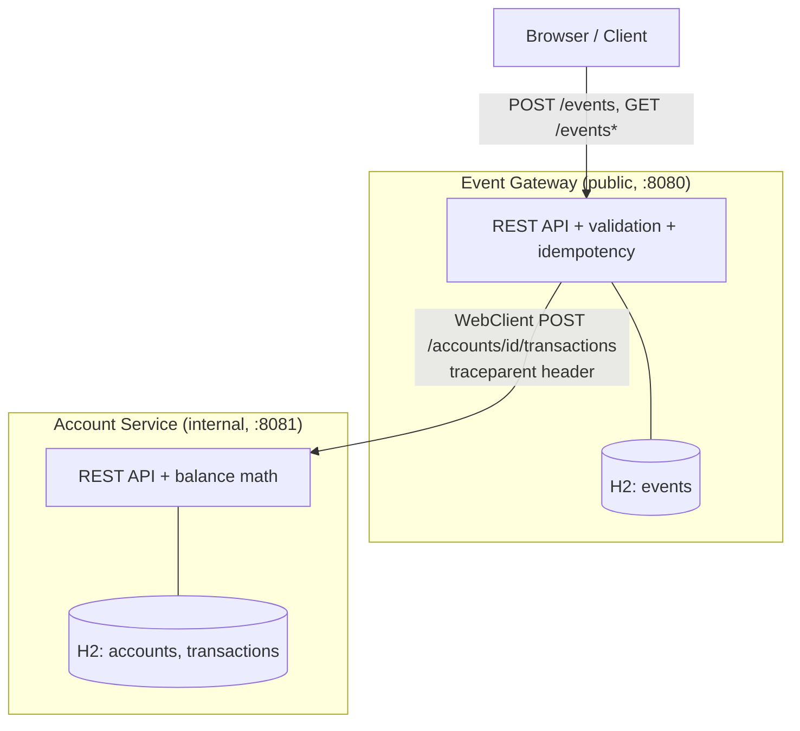

# Event Ledger — Implementation Plan

## Overview

Build an **Event Ledger** system: two independently-runnable microservices that ingest financial transaction events, enforce idempotency, tolerate out-of-order delivery, and degrade gracefully when a dependency is down. The emphasis is on **distributed-systems correctness, observability, and resiliency** — not feature breadth.

- **Event Gateway** (public-facing, port `8080`) — validates input, enforces idempotency, stores the event ledger, and orchestrates the downstream transaction apply.
- **Account Service** (internal, port `8081`) — owns account state (balances + transaction history) and the money math.

The two services **share no database and no in-process state**. The only channel between them is a synchronous REST call over the network.

### Key Design Decisions

These were settled during the design discussion; the rationale lives in the README's "Design Decisions" section.

- **Monorepo, two independent Maven modules** — `event-gateway/` and `account-service/` each have their own `pom.xml`, dependencies, H2 database, `mvn test`, and Dockerfile. 
- **Database per service** — Gateway owns `events`; Account Service owns `accounts` + `transactions`. Each is embedded H2 (in-memory). This is what makes graceful degradation meaningful: Gateway reads hit local data and keep working; balance reads require the Account Service and fail cleanly when it's down.
- **`BigDecimal` end-to-end for money** — entity, DTO, and arithmetic. Jackson configured with `USE_BIG_DECIMAL_FOR_FLOATS` so JSON numbers never pass through `double`. Scale pinned to 4, `RoundingMode.HALF_EVEN`.
- **`WebClient` for the Gateway→Account call (never `RestTemplate`)** — see [Design Decision: WebClient in an MVC app](#design-decision-webclient-in-an-mvc-app).
- **Idempotency enforced at BOTH layers** — Gateway keys on `eventId` (primary key). The Account Service *also* treats `eventId` as a unique idempotency key on `transactions`. This is not redundant: the resiliency **retry** can re-send the same transaction, and account-side idempotency is what stops a retry from double-applying a balance change.
- **Out-of-order handling falls out of the math** — balance = Σ CREDIT − Σ DEBIT is **commutative**, so arrival order never affects the balance as long as we *sum* rather than track a sequence-dependent running total on the wire. The only order-sensitive surface is the listing endpoint, solved with `ORDER BY event_timestamp`.
- **Event status lifecycle** — each event carries `RECEIVED → APPLIED | FAILED`. This is what powers graceful degradation (persist locally even when the apply fails) and sets up the async-fallback bonus (replay non-`APPLIED` events on recovery).
- **Resiliency: circuit breaker + timeout + bounded retry w/ backoff** on the Gateway→Account call. See [Phase 6](#phase-6-resiliency--graceful-degradation).
- **Tracing: W3C Trace Context (`traceparent`)** via Micrometer Tracing → OpenTelemetry bridge, with trace/span IDs pushed to SLF4J MDC so both services log the same `traceId`.
- **No corrections/reversals feature** — the spec's "out-of-order tolerance" is about arrival order, not amending past events. A DEBIT is how you offset a CREDIT. Noted in README; not built.

### Tech Stack

| Concern | Choice |
|---|---|
| Language / framework | Java 21, Spring Boot 3.4.x (Spring MVC) |
| Build | Maven (multi-module parent POM) |
| Database | H2 (in-memory), Spring Data JPA |
| HTTP client (Gateway→Account) | Spring `WebClient` |
| Resiliency | Resilience4j (circuit breaker, retry, time limiter) |
| Tracing | Micrometer Tracing + OpenTelemetry bridge (W3C `traceparent`) |
| Metrics | Micrometer + `/actuator/prometheus` |
| Structured logging | JSON logs with `traceId` via MDC |
| Tests | JUnit 5, WireMock (stub the peer), Testcontainers (one real E2E) |
| Packaging | Docker (Spring Boot `build-image`), Docker Compose |

### Architecture



### Repository Structure

```
event-ledger/
├── README.md
├── docker-compose.yml              # both services (+ optional Jaeger profile)
├── pom.xml                         # parent (module aggregation only)
├── docs/
│   └── implementation-plan.md      # this file
├── event-gateway/
│   ├── pom.xml
│   ├── Dockerfile                  # or spring-boot:build-image
│   └── src/main/java/com/eventledger/gateway/...
│   └── src/main/resources/{application.yml, schema.sql}
│   └── src/test/java/...
└── account-service/
    ├── pom.xml
    ├── Dockerfile
    └── src/main/java/com/eventledger/account/...
    └── src/main/resources/{application.yml, schema.sql}
    └── src/test/java/...
```

> [!NOTE]
> The parent `pom.xml` only aggregates modules for a one-command build (`mvn -q -T1C package`). It does **not** create a shared code dependency between the two services.

---

## Phase 1: Design & API Contracts *(planning — no application code)*

**This phase is the gate. No entity, controller, or service code is written until the contracts, entities, and DB schemas below are finalized.** The remainder of the document treats these as the source of truth.

### 1.1 Error Model (shared shape, defined independently in each service)

```json
{
  "error": "VALIDATION_ERROR",
  "message": "amount must be greater than 0",
  "traceId": "0af7651916cd43dd8448eb211c80319c",
  "timestamp": "2026-07-14T18:22:05Z"
}
```

Status-code map:

| Code | Meaning |
|---|---|
| `400 Bad Request` | Validation failure (missing field, amount ≤ 0, unknown type, bad ISO timestamp) |
| `404 Not Found` | Unknown `eventId` / `accountId` |
| `409 Conflict` | *(not used for duplicates — see idempotency decision below)* |
| `503 Service Unavailable` | Account Service unreachable / circuit open / timeout |
| `200 OK` | Successful read, or **duplicate** event submission (returns original) |
| `201 Created` | New event accepted and applied |

### 1.2 Trace Propagation Contract

- Propagation format: **W3C Trace Context** — header `traceparent` (and `tracestate` if present).
- Gateway generates a trace ID for each incoming request (continuing an inbound `traceparent` if one is already present — the OTel-idiomatic behavior).
- `WebClient` auto-injects `traceparent` on the outbound call; Account Service auto-extracts and continues the same trace.
- Both services log `traceId` (and `spanId`) on every log line via MDC.

### 1.3 Event Gateway — API Contract

**`POST /events`**

Request:
```json
{
  "eventId": "evt-001",
  "accountId": "acct-123",
  "type": "CREDIT",
  "amount": 150.00,
  "currency": "USD",
  "eventTimestamp": "2026-05-15T14:02:11Z",
  "metadata": { "source": "mainframe-batch", "batchId": "B-9042" }
}
```

Responses:
- `201 Created` — new event stored and applied. Body = stored event (below) with `status: "APPLIED"`.
- `200 OK` — duplicate `eventId`. Body = the **original** stored event, unchanged.
- `400 Bad Request` — validation error.
- `503 Service Unavailable` — event stored (`status: "RECEIVED"` or `"FAILED"`) but Account Service could not apply it. Body includes the stored event + error.

Stored-event body:
```json
{
  "eventId": "evt-001",
  "accountId": "acct-123",
  "type": "CREDIT",
  "amount": 150.00,
  "currency": "USD",
  "eventTimestamp": "2026-05-15T14:02:11Z",
  "metadata": { "source": "mainframe-batch", "batchId": "B-9042" },
  "status": "APPLIED",
  "receivedAt": "2026-07-14T18:22:05Z"
}
```

**`GET /events/{id}`** → `200` stored event, or `404`. Depends only on local data (works when Account Service is down).

**`GET /events?account={accountId}`** → `200` array of events for the account, **ordered by `eventTimestamp` ascending**. Depends only on local data.

**`GET /health`** → `200 { "service": "event-gateway", "status": "UP", "db": "UP" }` (or `503`/`DOWN`). `db` reflects an actual `SELECT 1` connectivity check.

### 1.4 Account Service — API Contract

**`POST /accounts/{accountId}/transactions`** (called only by the Gateway)

Request — note `eventId` travels as the idempotency key:
```json
{
  "eventId": "evt-001",
  "type": "CREDIT",
  "amount": 150.00,
  "currency": "USD",
  "eventTimestamp": "2026-05-15T14:02:11Z"
}
```

Response `200`/`201`:
```json
{
  "accountId": "acct-123",
  "eventId": "evt-001",
  "applied": true,
  "duplicate": false,
  "balance": 150.00,
  "currency": "USD"
}
```
- New transaction → `201`, `duplicate: false`, account auto-created if it didn't exist.
- Duplicate `eventId` → `200`, `duplicate: true`, balance unchanged (idempotent — this is what makes retries safe).
- `400` on validation failure.

**`GET /accounts/{accountId}/balance`** → `200 { "accountId": "...", "balance": 150.00, "currency": "USD" }`, or `404`.

**`GET /accounts/{accountId}`** → `200` account details + recent transactions, or `404`.

**`GET /health`** → same shape as the Gateway, `service: "account-service"`.

### 1.5 Event Gateway — DB Schema (H2)

```sql
CREATE TABLE events (
    event_id        VARCHAR(100)  PRIMARY KEY,        -- idempotency key
    account_id      VARCHAR(100)  NOT NULL,
    type            VARCHAR(10)   NOT NULL,           -- CREDIT | DEBIT
    amount          DECIMAL(19,4) NOT NULL,
    currency        VARCHAR(3)    NOT NULL,
    event_timestamp TIMESTAMP     NOT NULL,
    metadata        CLOB,                             -- raw JSON string
    status          VARCHAR(20)   NOT NULL,           -- RECEIVED | APPLIED | FAILED
    received_at     TIMESTAMP     NOT NULL
);
CREATE INDEX idx_events_account_ts ON events (account_id, event_timestamp);
```

### 1.6 Account Service — DB Schema (H2)

```sql
CREATE TABLE accounts (
    account_id  VARCHAR(100)  PRIMARY KEY,
    balance     DECIMAL(19,4) NOT NULL DEFAULT 0,
    currency    VARCHAR(3),
    created_at  TIMESTAMP     NOT NULL,
    updated_at  TIMESTAMP     NOT NULL
);

CREATE TABLE transactions (
    id              BIGINT AUTO_INCREMENT PRIMARY KEY,
    event_id        VARCHAR(100)  NOT NULL UNIQUE,    -- idempotency key from Gateway
    account_id      VARCHAR(100)  NOT NULL REFERENCES accounts(account_id),  -- FK: no orphaned transactions
    type            VARCHAR(10)   NOT NULL,
    amount          DECIMAL(19,4) NOT NULL,
    currency        VARCHAR(3)    NOT NULL,
    event_timestamp TIMESTAMP     NOT NULL,
    applied_at      TIMESTAMP     NOT NULL
);
CREATE INDEX idx_tx_account_ts ON transactions (account_id, event_timestamp);
```

**Balance strategy:** store a running `balance` on `accounts`, updated within the same transaction that inserts the `transactions` row, guarded by the `event_id` unique constraint (duplicate → no-op). Because the sum is commutative, the running total is correct regardless of arrival order. (A `SELECT SUM(...)` recompute is the fallback/verification path.)

**FK + auto-create ordering:** `transactions.account_id` is a foreign key to `accounts(account_id)` — no orphaned transactions can exist. Since accounts are auto-created on first transaction, `applyTransaction` must, within its single `@Transactional` unit, **upsert the account first, then insert the transaction**, so the account row exists before the FK is checked. The existing `idx_tx_account_ts (account_id, ...)` index already serves FK lookups, so no separate FK index is needed. *(Note the asymmetry: the Gateway's `events.account_id` is deliberately **not** a FK — the Gateway owns no `accounts` table, and you can't reference across a service boundary.)*

### 1.7 Entities

- **Gateway:** `Event` (maps `events`, `@Id eventId: String`, `amount: BigDecimal`, `status: EventStatus` enum, `metadata: String`).
- **Account Service:** `Account` (maps `accounts`, `@Id accountId: String`, `balance: BigDecimal`), `Transaction` (maps `transactions`, `@Id id: Long`, unique `eventId`, `amount: BigDecimal`, `type: TxType` enum).

### 1.8 Idempotency + Partial-Failure Decision

- **Duplicate where original is `APPLIED`** → return original, `200`. True idempotency, no downstream call.
- **Duplicate where original is `RECEIVED`/`FAILED`** → re-attempt the downstream apply (safe because the Account Service is idempotent on `eventId`), then return current state. Prevents an event from being permanently stuck un-applied after a transient outage.
- Core scope implements the `APPLIED`-duplicate path fully; the `FAILED`-replay path is implemented minimally and generalized by the **async-fallback bonus** (Phase 11).

### Design Decision: WebClient in an MVC app

We use blocking Spring MVC controllers (JPA/H2 is blocking) but `WebClient` for the one outbound call, per the requirement to avoid `RestTemplate`. Resilience4j is applied to the reactive `Mono` via its Reactor operators, and we `.block()` at the controller boundary. This keeps controllers simple while satisfying the WebClient constraint and giving Resilience4j a clean reactive chain to wrap.

---

## Phase 2: Account Service Scaffold *(boilerplate — must build & run clean)*

Bring up the Account Service as an empty-but-running Spring Boot app so the build is green before any business logic.

- `account-service/pom.xml` — Spring Boot parent, deps: `spring-boot-starter-web`, `spring-boot-starter-data-jpa`, `com.h2database:h2`, `spring-boot-starter-actuator`, Lombok, test starter.
- Package skeleton: `com.eventledger.account.{api,service,repository,entity,model,config}`.
- `application.yml` — port `8081`, H2 in-memory URL, JPA `ddl-auto: none` (+ `schema.sql`), Jackson `USE_BIG_DECIMAL_FOR_FLOATS`, baseline JSON logging.
- `GET /health` controller returning `{service, status, db}` with a real DB connectivity check.
- **Exit criteria:** `mvn -pl account-service package` succeeds; app boots; `GET /health` → `200 UP`.

---

## Phase 3: Event Gateway Scaffold *(boilerplate — must build & run clean)*

Same treatment for the Gateway, plus the WebClient wiring stub.

- `event-gateway/pom.xml` — as above + `spring-boot-starter-webflux` (for `WebClient` only), Resilience4j starter (config added in Phase 6).
- Package skeleton: `com.eventledger.gateway.{api,service,repository,entity,model,client,config}`.
- `application.yml` — port `8080`, H2, `account-service.base-url: http://localhost:8081` (overridable by env for Docker), Jackson/logging as above.
- `WebClientConfig` — a `WebClient` bean pointing at `account-service.base-url`.
- `GET /health` controller (same shape).
- **Exit criteria:** `mvn -q package` at repo root builds **both** modules; both apps boot; both `/health` return `200 UP`.

---

## Phase 4: Account Service — Core

- `Account`, `Transaction` entities + repositories (`TransactionRepository.existsByEventId`, `findByAccountIdOrderByEventTimestampAsc`).
- `AccountService.applyTransaction(...)`: idempotency check on `eventId` → if exists, return `duplicate=true` with current balance; else insert transaction + update running balance (`BigDecimal`, CREDIT `+`, DEBIT `−`) in one `@Transactional` unit; auto-create account on first transaction.
- `GET balance`, `GET account details` (with recent transactions).
- Validation: `type ∈ {CREDIT, DEBIT}`, `amount > 0`, required fields → `400`.
- **Exit criteria:** apply/duplicate/balance verified by hand (curl); unit tests deferred to Phase 9.

---

## Phase 5: Event Gateway — Core

- `Event` entity + repository (`findByAccountIdOrderByEventTimestampAsc`).
- `POST /events`: validate → idempotency check (`eventId` PK) → persist `RECEIVED` → call Account Service via `AccountClient` (WebClient) → on success mark `APPLIED` (`201`), on duplicate return original (`200`). *(Resiliency/`503` behavior lands in Phase 6 — here we assume the happy path + basic error.)*
- `GET /events/{id}` and `GET /events?account=` — local-only reads, listing ordered by `eventTimestamp`.
- `AccountClient` — WebClient call to `POST /accounts/{id}/transactions`, mapping the Gateway event to the transaction request.
- **Exit criteria:** full happy-path submit → apply → balance reflected in Account Service, verified by curl.

---

## Phase 6: Resiliency & Graceful Degradation

Wrap the `AccountClient` call in Resilience4j and define degradation behavior.

`application.yml` (Gateway):
```yaml
resilience4j:
  circuitbreaker.instances.accountService:
    sliding-window-size: 10
    failure-rate-threshold: 50
    wait-duration-in-open-state: 5s
    permitted-number-of-calls-in-half-open-state: 1
  retry.instances.accountService:
    max-attempts: 3
    wait-duration: 200ms
    enable-exponential-backoff: true
    exponential-backoff-multiplier: 2
    # + jitter (randomized-wait-factor) for the bonus
  timelimiter.instances.accountService:
    timeout-duration: 2s
```

- Apply operators to the WebClient `Mono` (`CircuitBreakerOperator`, `RetryOperator`, per-attempt timeout). **Composition order** — retry outside the breaker, per-attempt timeout innermost, breaker records each attempt — to be finalized and asserted during implementation.
- Fallback → `AccountServiceUnavailableException` → `@ControllerAdvice` maps to **`503`** with the stored event + error.
- **Graceful degradation matrix:**
  - `POST /events` when Account down → event persisted (`FAILED`), `503` (never hang, never `500`).
  - `GET /events/{id}`, `GET /events?account=` → still `200` (local data).
  - Balance queries proxied through Gateway (if any) → clear `503`.
- README: explain **why circuit breaker** (fast-fail on sustained outage, most demonstrable), why timeout (anti-hang), why retry+backoff (transient blips), and why bulkhead was considered but deferred.
- **Exit criteria:** manual failure injection (stop Account Service) shows `503` on writes, `200` on local reads, breaker opens after threshold.

---

## Phase 7: Observability & Distributed Tracing *(telemetry)*

- **Tracing:** add `micrometer-tracing-bridge-otel` + OTLP exporter to both services. Verify `traceparent` is injected by WebClient and extracted by the Account Service; same `traceId` appears in both services' logs for one client request.
- **Structured logging:** JSON logs carrying `timestamp`, `level`, `service`, `traceId`, `spanId`, `message` on both services (Spring Boot 3.4 structured logging or `logstash-logback-encoder`).
- **Health diagnostics:** `/health` reports DB connectivity (already stubbed in scaffold; confirm real check).
- **Custom metric:** Micrometer `Counter` `gateway_events_submitted_total{result=created|duplicate|rejected|degraded}` on the Gateway, plus the auto-provided HTTP latency histogram. Exposed at `/actuator/prometheus`.
- **Exit criteria:** one `POST /events` produces a single trace spanning both services (visible in logs, and in Jaeger if the bonus profile is up); `/actuator/prometheus` shows the counter incrementing by result.

---

## Phase 8: Docker Compose & Local Run

- `Dockerfile` per service (or `spring-boot:build-image`).
- `docker-compose.yml` — `account-service` (`:8081`) + `event-gateway` (`:8080`, `ACCOUNT_SERVICE_URL=http://account-service:8081`, `depends_on`). Optional `jaeger` service behind a Compose profile for the tracing-viz bonus.
- Manual (non-Docker) run instructions as the spec-permitted fallback.
- **Exit criteria:** `docker compose up` brings up both; end-to-end curl works via the composed network using service-name DNS.

---

## Phase 9: Automated Tests *(runnable via `mvn test`)*

- **Component tests (per service, peer stubbed with WireMock / `MockRestServiceServer`):**
  - Idempotency (duplicate `eventId` → original, no balance change).
  - Out-of-order (submit later-timestamp first; assert listing order + correct balance).
  - Balance math (CREDIT/DEBIT sums, `BigDecimal` precision).
  - Validation (missing fields, `amount ≤ 0`, unknown type → `400`).
  - **Resiliency:** stub returns `500`/delay → assert breaker opens, `503` returned fast, retries bounded.
  - **Trace propagation:** assert the stub *received* a `traceparent` header.
- **Integration (one real E2E):** Testcontainers boots the real Account Service; Gateway submits an event; assert balance actually updated across the wire. *(Fallback: in-process `@SpringBootTest` of both contexts if Docker-in-test is undesirable.)*
- **Exit criteria:** `mvn test` green at repo root, hermetic (no manually-started processes).

---

## Phase 10: README

Architecture overview • prerequisites/setup • how to run (Docker Compose + manual) • how to run tests • **resiliency pattern rationale** • design-decisions section (idempotency-at-both-layers, out-of-order-via-commutativity, WebClient-in-MVC, no-corrections-feature, currency assumption). Keep commit history meaningful throughout (per submission rules).

---

## Phase 11: Async Fallback *(bonus — only if core is polished and time remains)*

Queue non-`APPLIED` events locally when the Account Service is down; a background worker replays them (idempotently, thanks to account-side `eventId` uniqueness) on recovery, transitioning `FAILED → APPLIED`. High-signal walkthrough talking point even if partially built.

---

## Phase Progress

This section tracks implementation progress for each phase.

### Phase 1: Design & API Contracts
**Status**: ✅ Completed (2026-07-14)

**Completed**:
- [x] Error model + status-code map
- [x] Trace propagation contract (W3C `traceparent`)
- [x] Event Gateway API contract (all 4 endpoints, request/response/status)
- [x] Account Service API contract (all 4 endpoints)
- [x] Gateway DB schema (`events`)
- [x] Account Service DB schema (`accounts`, `transactions`)
- [x] Entity definitions for both services
- [x] Idempotency + partial-failure decision
- [x] WebClient-in-MVC design decision recorded

**Remaining**:
- None — contracts frozen; implementation may begin.

**Implementation Notes**:
- Contracts, schemas, and entities are defined in this document and are the source of truth for Phases 2–11.
- Key cross-cutting decision: `eventId` is the idempotency key at **both** the Gateway (PK) and Account Service (unique on `transactions`) so resiliency retries cannot double-apply.

---

### Phase 2: Account Service Scaffold
**Status**: ✅ Completed (2026-07-14)

**Completed**:
- [x] `pom.xml` with web/JPA/H2/actuator deps (Spring Boot 3.4.5, Java 21)
- [x] Package skeleton + `application.yml` (port 8081, H2, Jackson BigDecimal)
- [x] `GET /health` with real DB connectivity check
- [x] `schema.sql` (accounts + transactions, from §1.6) wired via `spring.sql.init`

**Remaining**:
- None

**Implementation Notes**:
- **Files**: `account-service/pom.xml`, `AccountServiceApplication.java`, `api/HealthController.java`, `application.yml`, `schema.sql`.
- Parents off `spring-boot-starter-parent` independently (aggregator root `pom.xml` only lists modules — no shared code).
- H2 in-memory (`jdbc:h2:mem:accountdb`), `ddl-auto: none` + `schema.sql` as the schema source, `defer-datasource-initialization: true`.
- `GET /health` runs `SELECT 1` via `JdbcTemplate` → `{service, status, db, timestamp}`, `503` if the DB check fails.
- **Verified**: builds; boots; `GET /health` → `200 {"status":"UP","db":"UP"}`.

---

### Phase 3: Event Gateway Scaffold
**Status**: ✅ Completed (2026-07-14)

**Completed**:
- [x] `pom.xml` (web/JPA/H2/actuator + webflux for WebClient)
- [x] Package skeleton + `application.yml` (port 8080, H2, account-service base-url)
- [x] `WebClientConfig` bean
- [x] `GET /health` with real DB connectivity check
- [x] `schema.sql` (events, from §1.5) wired via `spring.sql.init`

**Remaining**:
- None

**Implementation Notes**:
- **Files**: `event-gateway/pom.xml`, `EventGatewayApplication.java`, `api/HealthController.java`, `config/WebClientConfig.java`, `application.yml`, `schema.sql`.
- `spring-boot-starter-webflux` added for `WebClient` only; `spring.main.web-application-type: servlet` pins it to Tomcat/MVC while keeping WebClient available.
- `WebClientConfig` exposes an `accountServiceWebClient` bean with base URL from `account-service.base-url` (env-overridable via `ACCOUNT_SERVICE_BASE_URL` for Docker).
- **Deviation from plan**: Resilience4j dependency deferred to Phase 6 (kept scaffold minimal / build clean); config + deps land with the resiliency work. `/actuator/prometheus` also deferred to Phase 7 (registry dependency not yet added — endpoint pre-listed in exposure only).
- **Verified**: repo-root `mvn -T1C package` builds **both** modules; both boot; both `GET /health` → `200 {"status":"UP","db":"UP"}`.
- Added root `.gitignore` for `target/` build output.

---

### Phase 4: Account Service — Core
**Status**: ✅ Completed (2026-07-14)

**Completed**:
- [x] `Account` / `Transaction` entities + repositories
- [x] `applyTransaction` with idempotency + running-balance update (`BigDecimal`)
- [x] Balance + account-details endpoints
- [x] Validation → 400

**Remaining**:
- None

**Implementation Notes**:
- **Files**: `entity/{Account,Transaction,TxType}`, `repository/{AccountRepository,TransactionRepository}`, `model/{ApplyTransactionRequest,ApplyTransactionResponse,BalanceResponse,AccountDetailsResponse,TransactionView,ErrorResponse}`, `service/AccountService`, `api/{AccountController,GlobalExceptionHandler}`, `exception/NotFoundException`.
- **Idempotency**: `findByEventId` → duplicate returns `{applied:true, duplicate:true}` with current balance (HTTP 200), no re-apply. New apply → HTTP 201.
- **FK ordering**: account upserted via `saveAndFlush` *before* the transaction insert, so `transactions.account_id` FK is satisfied on auto-created accounts.
- **Balance**: running total on `accounts`, signed `BigDecimal` (CREDIT `+`, DEBIT `−`), scale 4.
- **Validation**: `@Pattern(CREDIT|DEBIT)` + `@Positive` amount + `@NotBlank/@NotNull` → 400 via `GlobalExceptionHandler`; also handles malformed JSON and `NotFoundException` (404).
- Added `spring-boot-starter-validation` (not transitive from starter-web).
- **Verified** (curl): apply→201, duplicate→200 (balance unchanged), balance = 150−50 = 100.0000, bad amount→400, unknown type→400, account details returns recent transactions.

---

### Phase 5: Event Gateway — Core
**Status**: ✅ Completed (2026-07-14)

**Completed**:
- [x] `Event` entity + repository (ordered listing)
- [x] `POST /events` (validate → idempotency → persist → WebClient apply)
- [x] `GET /events/{id}` + `GET /events?account=` (local reads)
- [x] `AccountClient` (WebClient)

**Remaining**:
- None

**Implementation Notes**:
- **Files**: `entity/{Event,EventStatus,TransactionType}`, `repository/EventRepository`, `model/{SubmitEventRequest,EventResponse,ErrorResponse}`, `client/{AccountClient,AccountApplyRequest,AccountApplyResult}`, `service/{EventService,EventMapper,SubmitResult}`, `api/{EventController,GlobalExceptionHandler}`, `exception/{NotFoundException,AccountServiceUnavailableException}`.
- **Idempotency**: `eventId` PK; duplicate returns the original stored event (HTTP 200), new → 201. Concurrent-duplicate race caught via `DataIntegrityViolationException` → returns the winner.
- **No method-level `@Transactional` on submit** — event is persisted (RECEIVED) and committed *before* the downstream call, so a failed apply still leaves a durable FAILED record (graceful degradation + replay).
- **`AccountClient`** uses the `accountServiceWebClient` bean; plain `.block()` for now (Resilience4j wrapping is Phase 6).
- **Metadata** accepted as opaque `JsonNode`, stored as raw JSON string, round-tripped on read; **not** forwarded to the Account Service.
- **Basic error handling** (full resiliency is Phase 6): apply failure → event set FAILED, `AccountServiceUnavailableException` → HTTP 503.
- **Verified** (curl): submit→201 APPLIED, duplicate→200, **out-of-order** (submit 16:00 then 10:00 → listing returns 10:00 first, balance correct = 100.0000 regardless of order), GET by id 200/404, and **graceful degradation** (Account Service stopped → POST 503 with event stored FAILED, GET by-id/list still 200, Gateway `/health` still UP).
- **Known minor**: fresh-write response shows submitted scale (`150.00`) while DB-read responses show column scale (`150.0000`) — same value, cosmetic; can normalize scale on output later if desired.

---

### Phase 6: Resiliency & Graceful Degradation
**Status**: ✅ Completed (2026-07-14)

**Completed**:
- [x] Resilience4j config (circuit breaker + retry w/ backoff + jitter + per-attempt timeout)
- [x] Operators applied to WebClient `Mono` + fallback → 503
- [x] Graceful degradation matrix (writes 503, local reads 200)
- [ ] README resiliency rationale (deferred to Phase 10 README)

**Remaining**:
- README write-up only (Phase 10).

**Implementation Notes**:
- **Deps**: `resilience4j-spring-boot3` + `resilience4j-reactor` (v2.2.0) + `spring-boot-starter-aop`, in `event-gateway/pom.xml`.
- **Config** (`application.yml`, instance `accountService`): circuit breaker (COUNT window 10, min 5 calls, 50% threshold, 5s open-state, 2 half-open probes, auto half-open, health indicator on); retry (3 attempts, 200ms base, exponential ×2, randomized jitter, **ignores `CallNotPermittedException`** so it fast-fails when open); timeout via `account-service.call-timeout: 2s`.
- **Composition** (`AccountClient`): `retry ( circuitBreaker ( Mono.timeout ( call ) ) )` — retry outermost drives attempts, breaker records each attempt, each attempt has its own timeout. Used Reactor `Mono.timeout()` for the per-attempt limit (resilience4j `TimeLimiter` targets `CompletableFuture`, not Reactor) — small, documented deviation from the plan's yaml sketch.
- **Fallback**: any failure (timeout / connection / 5xx / open circuit) propagates from `.block()` → `EventService` sets event FAILED → `AccountServiceUnavailableException` → HTTP 503.
- **Actuator**: `/actuator/circuitbreakers` + `circuitbreakerevents` exposed; breaker state also surfaced in `/actuator/health`.
- **Verified** (curl, Account Service killed): full lifecycle **CLOSED → OPEN → HALF_OPEN → CLOSED**. Timing proves it — POST #1 `503` in 720ms (3 retries + backoff), breaker trips, subsequent POSTs `503` in **~5ms** (fast-fail, no network call); after the 5s cool-off the breaker auto-moved to HALF_OPEN and 2 successful probes (201) closed it. Local reads (`GET /events/{id}`, `?account=`) and Gateway `/health` stayed `200` throughout.
- **Not yet exercised live**: the *slow-response* timeout path (vs. connection-refused). Configured and will be asserted in Phase 9 with a delayed WireMock stub.
- **Bulkhead**: intentionally not built — documented as considered-and-deferred (see interview-study-guide Topic 3); cheap to add if time allows.

---

### Phase 7: Observability & Distributed Tracing
**Status**: ✅ Completed (2026-07-14)

**Completed**:
- [x] Micrometer Tracing + OTel bridge on both services
- [x] Structured JSON logging with `traceId`/`spanId`
- [x] `/health` DB diagnostics confirmed
- [x] Custom metric `gateway_events_submitted_total` + `/actuator/prometheus`

**Remaining**:
- None (optional Jaeger/Zipkin *visualization* is a Phase 8 bonus — an OTLP exporter block in Compose).

**Implementation Notes**:
- **Deps** (both services): `io.micrometer:micrometer-tracing-bridge-otel` (trace context + W3C `traceparent` propagation), `io.micrometer:micrometer-registry-prometheus` (Prometheus endpoint).
- **Tracing**: `management.tracing.sampling.probability: 1.0` (trace every request for the demo). The Boot-provided `WebClient.Builder` (used in `WebClientConfig`) is auto-instrumented, so the Gateway injects `traceparent` on the outbound call and the Account Service auto-extracts it — no manual header code. No span *exporter* configured (logs-only); the OTLP exporter → Jaeger is the Phase 8 bonus.
- **Structured logging**: Spring Boot 3.4 native structured logging, `logging.structured.format.console: ecs`. Fields: `@timestamp`, `log.level`, `service.name`, `traceId`, `spanId`, `message`, `log.logger`. `service.name` set per module.
- **Custom metrics**: Gateway `gateway.events.submitted{result=created|duplicate|rejected|degraded}` (in `EventService` + validation handler); Account `account.transactions.applied{outcome=applied|duplicate}` (in `AccountService`). Both exposed at `/actuator/prometheus`. (Switched both service beans from Lombok `@RequiredArgsConstructor` to explicit constructors to inject `MeterRegistry`.)
- **Verified** (curl + log inspection): one `POST /events` produced **the same `traceId` in both services' logs** (`event-gateway` parent span → `account-service` child span), proving cross-service propagation. Prometheus showed `gateway_events_submitted_total{result="created"} 2, {result="duplicate"} 1, {result="rejected"} 1` and `account_transactions_applied_total{outcome="applied"} 2`. Both `/actuator/prometheus` → 200.
- **Note**: the ECS log field for the trace is flat `traceId`/`spanId` (populated from Micrometer's MDC), not nested `trace.id` — still valid JSON carrying the trace ID as the spec requires.

---

### Phase 8: Docker Compose & Local Run
**Status**: ✅ Completed (2026-07-15)

**Completed**:
- [x] Dockerfile per service (multi-stage)
- [x] `docker-compose.yml` (both services; healthchecks + DNS wiring)
- [ ] Manual run instructions (→ Phase 10 README)
- [ ] Optional Jaeger profile (bonus — deferred; needs OTLP exporter dep)

**Remaining**:
- Manual-run instructions belong in the README (Phase 10).
- Jaeger/OTLP trace *visualization* remains a documented bonus.

**Implementation Notes**:
- **Dockerfiles** (`account-service/Dockerfile`, `event-gateway/Dockerfile`): multi-stage — `maven:3.9-eclipse-temurin-21` build stage (`dependency:go-offline` layer for cache, then `package`), `eclipse-temurin:21-jre` runtime with `curl` for the healthcheck. **No host Maven/JDK needed** — `docker compose up --build` compiles from source. Relies on each module building standalone (parents off `spring-boot-starter-parent`, not the aggregator).
- **`.dockerignore`** per module excludes `target/`.
- **`docker-compose.yml`**: both services with container healthchecks (`curl -f /health`); Gateway `depends_on` account-service `condition: service_healthy`; `ACCOUNT_SERVICE_BASE_URL: http://account-service:8081` overrides the localhost default via Compose service-name DNS.
- **Verified** (`docker compose build` + `up -d`): both containers reach **healthy** (account healthy before gateway starts, per `depends_on`); `POST /events` → 201 applied **across containers**; balance = 200.0000 on the Account Service (proves the cross-container call); `printenv` confirms the Gateway used `http://account-service:8081` (DNS, not localhost); **same `traceId` in both containers' logs** (distributed tracing works container-to-container).
- **Jaeger bonus**: not wired — logs-only tracing keeps the default `up` clean (no exporter, no connection-refused spam). Adding it = `opentelemetry-exporter-otlp` dep + a `jaeger` service under a Compose `tracing` profile + OTLP endpoint env. Left as a documented follow-up.

---

### Phase 9: Automated Tests
**Status**: ✅ Completed (2026-07-15)

**Completed**:
- [x] Component tests (idempotency, out-of-order, balance, validation)
- [x] Resiliency test (breaker opens, fast 503, timeout, graceful degradation)
- [x] Trace-propagation test (same traceId Gateway → Account)
- [x] One real E2E (Testcontainers, full flow across real containers)

**Remaining**:
- None.

**Test suite (28 tests total):**
- **`AccountApiTest`** (12, `mvn test`) — `@SpringBootTest`+MockMvc against real H2: credit/debit net balance, idempotent duplicate, out-of-order commutativity, **BigDecimal precision (0.10+0.20=0.30, no float drift)**, unknown account → 404, and a **parameterized validation sweep** (negative amount, zero amount, unknown type, missing eventId, missing currency, missing eventTimestamp, malformed JSON) → 400.
- **`EventApiTest`** (11, `mvn test`) — Gateway with WireMock-stubbed Account Service: happy path 201/APPLIED, duplicate → 200 original + not re-forwarded, invalid amount → 400 (no downstream call), listing ordered by `eventTimestamp` (not arrival), unknown event → 404, and a **parameterized validation sweep** (zero amount, unknown type, missing eventId/accountId/eventTimestamp, malformed JSON) → 400 **and never forwarded downstream**.
- **`ResiliencyTest`** (4, `mvn test`) — WireMock failure injection: 500 → 503 + event stored FAILED + local read still 200; **retries are bounded** (single failing POST → exactly `max-attempts` downstream calls); slow response (>timeout) → 503; repeated failures **open the breaker** then fast-fail without calling downstream (asserts breaker state OPEN + no new WireMock calls).
- **`FullFlowIT`** (1, `mvn verify`) — **both services as real containers** on a shared network (Testcontainers, `ImageFromDockerfile`): submit → 201 APPLIED, balance actually updates on the Account Service, and the Gateway's `traceId` appears in the Account container's logs (real cross-process trace propagation). `disabledWithoutDocker = true`.

**Coverage additions from a Codex review of Phase 9** (3 of 5 findings actioned): bounded-retry assertion, validation edge cases (zero amount / missing fields / malformed body), and a BigDecimal-precision test. Two findings not actioned: the E2E stays in `mvn verify` (standard surefire/failsafe split — README calls out `mvn verify` for the full suite); a component-level `traceparent` header assertion is infeasible in the in-JVM harness (documented above) so it lives in the two-container E2E instead.

**Implementation Notes**:
- **Deps** (gateway): `org.wiremock:wiremock-standalone:3.9.2`, `org.testcontainers:junit-jupiter` (BOM-managed) + `maven-failsafe-plugin` (so `*IT` runs in `mvn verify`, keeping `mvn test` fast).
- **Test resilience timings** tightened via `src/test/resources/application-test.yml` + `@ActiveProfiles("test")` (400ms timeout, 2 retries, small breaker window) for fast, deterministic resiliency tests.
- **Trace-propagation testing — key finding**: the in-JVM `@SpringBootTest` harness does **not** reproduce `traceparent` injection (the blocking→reactive-Netty context propagation doesn't carry the trace to the outbound WebClient thread in-process), even though the **real running app does propagate** (re-confirmed manually). So the trace assertion lives in the **two-container E2E**, where the Gateway is a real process — the only faithful reproduction. Attempts that did *not* fix the in-JVM case: `RANDOM_PORT`+`TestRestTemplate`, direct `AccountClient` call with an explicit span, `Hooks.enableAutomaticContextPropagation()`.
- **Production changes made while investigating (kept — correct hygiene)**: `WebClientConfig` now wires `ObservationRegistry` explicitly into the builder; `application.yml` sets `spring.reactor.context-propagation: auto`.
- **Verified**: `mvn test` → 14 green (6 account + 8 gateway); `mvn verify` → +1 E2E green (~2 min for the in-test image builds).

---

### Phase 10: README
**Status**: Not Started

**Completed**:
- [ ] Architecture + setup + run + test sections
- [ ] Resiliency rationale + design-decisions section

**Remaining**:
- All items pending

**Implementation Notes**:
- Keep commit history meaningful per submission rules.

---

### Phase 11: Async Fallback *(bonus)*
**Status**: Not Started

**Completed**:
- [ ] Local queue of non-`APPLIED` events
- [ ] Background replay worker (idempotent) on recovery

**Remaining**:
- All items pending (stretch)

**Implementation Notes**:
- Only if core is polished and time remains.

---

## Known Issues / Blockers
*(None yet)*

---

## Risk Mitigation

### High Priority
1. **Double-applied balances on retry** — `eventId` unique on `transactions`; apply is idempotent and returns `duplicate=true`.
2. **Money precision** — `BigDecimal` end-to-end; Jackson `USE_BIG_DECIMAL_FOR_FLOATS`; scale 4, HALF_EVEN.
3. **Hanging / 500 on dependency outage** — timeout + circuit breaker + `503` fallback; local reads unaffected.

### Medium Priority
1. **Out-of-order correctness** — commutative sum for balance; `ORDER BY event_timestamp` for listing.
2. **Event stuck un-applied after transient outage** — `FAILED`-duplicate replay path (Phase 5/6), generalized by async fallback (Phase 11).
3. **Reactive/blocking mismatch (WebClient in MVC)** — Resilience4j Reactor operators + `.block()` at the boundary; documented decision.

### Low Priority
1. **Mixed-currency accounts** — out of scope; reject or document assumption (no FX in spec).

---

**Document Version**: 1.0
**Last Updated**: July 14, 2026
**Author**: Adam Punnoose (planning assisted by Claude)
**Status**: Contracts frozen — ready for implementation (Phase 2)
